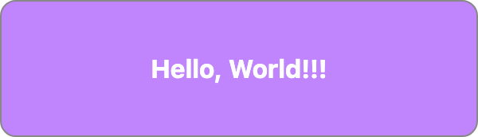

# JSX To Image

`jsx2img` is a powerful tool that converts JSX and HTML to images using Puppeteer, providing an easy way to generate visual representations of your components.

## 🌟 Features

- [x] Convert JSX/TSX to image (Preact, React compatible)
- [x] Convert HTML to image
- [x] Support custom styling
- [x] Flexible data injection
- [x] Support Tailwind CSS parser
- [ ] Supports build-in templates (Upcoming)


## 💡 Quick Start

### Local Development

```
# Clone the repository
git clone https://github.com/zzzgydi/jsx2img.git

# Install dependencies
pnpm install

# Start development server
pnpm dev

# Test
pnpm run test
```

### Docker

```
# Build
docker build -t jsx2img .

# Run
docker run -p 3000:3000 jsx2img
```

### Usage Example

```
curl -X POST http://localhost:3000/convert -d '{
    "jsx": "const App = ({data}) => <div className=\"hello text-center bg-purple-400 text-white font-bold\">Hello, {data.world}</div>;",
    "data": { "world": "World!!!" },
    "width": 300,
    "height": 300,
    "style": ".hello { border: 1px solid #888; padding: 30px 10px; border-radius: 10px;  }",
    "options": { "tailwind": true }
}'
```

Response image:



## 📝 License

This project is licensed under the MIT License. See the [LICENSE](LICENSE) file for details.

## 📚 References

- [Esbuild](https://esbuild.github.io/)
- [Preact](https://preactjs.com/)
- [Puppeteer](https://github.com/puppeteer/puppeteer)
